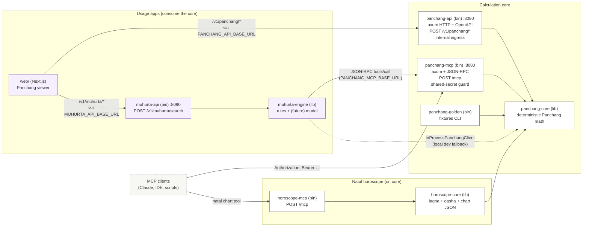
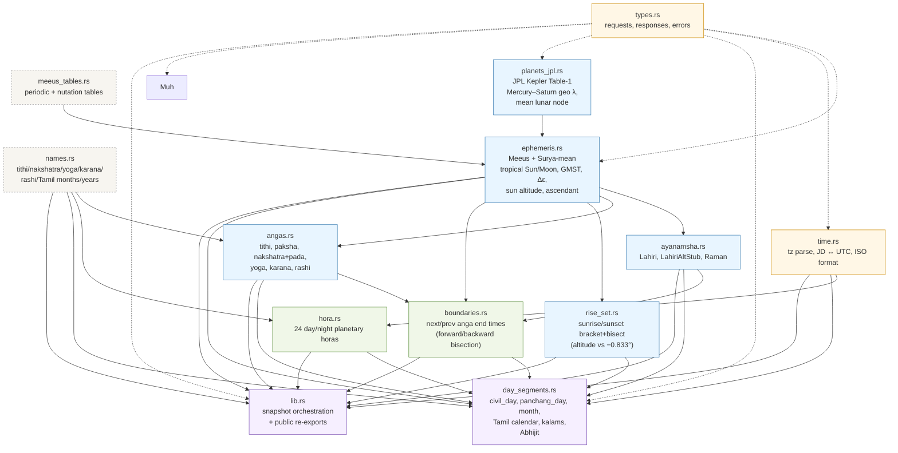
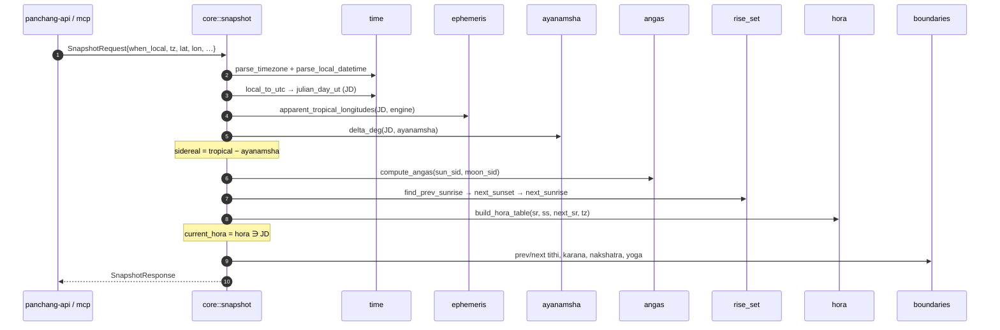
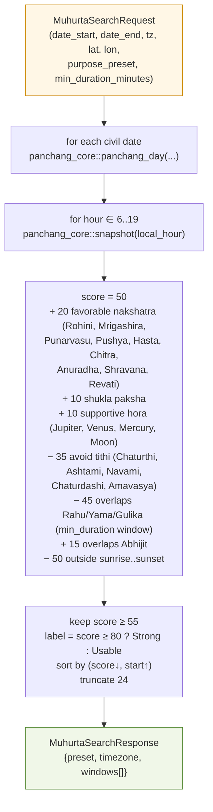
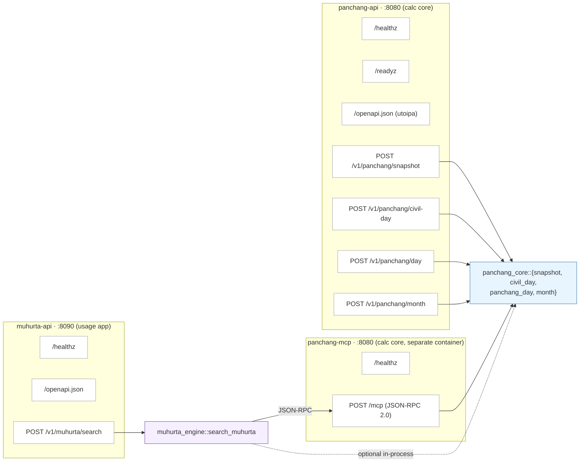

# Rust Engine — Code & Design Review

A walkthrough of `rust/`: workspace shape, module responsibilities, data flow,
and a candid review (what is sharp, what to keep an eye on, where to extend).

Peer-review status: this document reflects the current split after the
auspicious-time code was moved out of `panchang-core` and into
`muhurta-engine` / `muhurta-api`. No application code changes are implied by
this review.

The repo is intentionally split into **two layers** plus an optional **natal
horoscope MCP**:

- **Calculation core** (`panchang-core` + `panchang-api` + `panchang-mcp`) —
  deterministic Panchang answers and nothing else. This *is* the "Panchang MCP engine".
- **Natal horoscope** (`horoscope-core` + `horoscope-mcp`) — South Indian chart
  JSON built **on top of** `panchang-core` (same ephemeris / snapshot / ayanamsha).
- **Usage apps** that consume the core — `web` (Next.js viewer) and
  `muhurta-engine` + `muhurta-api` (auspicious-time scoring, where future
  ML model training will live).

The Panchang core never imports a usage app; usage apps depend on the core only
through its public API. Horoscope reuses `panchang-core` but does not change it.

## 1. Workspace topology



- **`panchang-core`** is the only crate with Panchang math. It exposes pure
  functions (`snapshot`, `civil_day`, `panchang_day`, `month`) plus
  request/response DTOs. **It deliberately does not contain auspicious-time
  scoring** — that lives in the muhurta usage app.
- **`panchang-api`** and **`panchang-mcp`** are thin transport adapters over
  the core. Neither holds business state.
- **`panchang-golden`** is a fixture runner used in CI / dev to print stable
  outputs for hand-spot-checks (no DB, no network).
- **`muhurta-engine`** owns the auspicious-time *rules*. Production wiring is
  `McpPanchangClient` in `muhurta-engine/src/client.rs`: JSON-RPC `tools/call`
  against `panchang-mcp`. `InProcessPanchangClient` calls `panchang_core::*`
  directly when `PANCHANG_MCP_BASE_URL` is unset (fast local iteration only).
  The request shape is currently calendar/event-window oriented; personal
  inputs such as janma nakshatra, janma rashi, and natural-language intent are
  planned but not part of the current contract.
- **`muhurta-api`** is a tiny axum binary on **port 8090** exposing
  `POST /v1/muhurta/search` and an OpenAPI doc.
- **`horoscope-core`** + **`horoscope-mcp`** implement the South Indian natal chart MCP tool (`calculate_south_indian_natal_chart`); see **`docs/horoscope-mcp.md`**.
- All eight Rust crates share workspace dependencies (`chrono`, `chrono-tz`,
  `serde`, `axum`, `tokio`, `utoipa`/`schemars`).

## 2. `panchang-core` module map



### Layer summary

| Layer | Module | Role |
|-------|--------|------|
| Foundation | `types`, `time` | DTOs, error type, `chrono_tz` parsing, JD math |
| Static data | `meeus_tables`, `names` | Periodic / nutation coefficients, name tables |
| Calc primitives | `ephemeris`, `ayanamsha`, `angas`, `rise_set`, `planets_jpl` | Pure math (JD + observer → numbers); `planets_jpl` adds JPL Kepler Mercury–Saturn + mean lunar node |
| Boundary search | `boundaries`, `hora` | Find when angas roll over; build hora table |
| Orchestration | `day_segments`, `lib` | Compose the primitives into request-shaped responses |

A clean rule of thumb: **arrows only point up the layers**. No primitive
module imports an orchestration module, which keeps the dependency graph a
DAG and makes it easy to test calc primitives in isolation.

## 3. Snapshot data flow



## 4. Day / Month flow (`panchang_day`)

```mermaid
sequenceDiagram
  autonumber
  participant Caller
  participant Day as day_segments::panchang_day
  participant Time as time
  participant Rise as rise_set
  participant Bnd as boundaries
  participant Hora as hora
  participant Tcal as tamil_calendar_day
  participant Periods as inauspicious / auspicious

  Caller->>Day: PanchangDayRequest{date, tz, lat, lon, day_mode}
  Day->>Time: civil_window(date, tz) → (jd0, jd1)
  Day->>Rise: find_next_sunrise → sunset → next_sunrise
  alt day_mode = sunrise_day
    Day->>Day: day_start = sunrise; day_end = next_sunrise
  else day_mode = civil_midnight (default)
    Day->>Day: day_start = jd0; day_end = jd1
  end
  Day->>Hora: build_hora_table(sr, ss, next_sr, tz) (when all known)
  Day->>Tcal: angas_at_jd(sr) → sun_rashi → solar month / year / ayana / ritu
  Day->>Periods: inauspicious_periods (Rahu/Yama/Gulika at day-eighths)
  Day->>Periods: auspicious_periods (Abhijit at day-fifteenth around noon)
  loop for kind ∈ {Tithi, Nakshatra, Yoga, Karana}
    Day->>Bnd: prev_start_jd, next_end_jd at probe times in [day_start, day_end]
    Day->>Day: clip + label each segment
  end
  Day-->>Caller: PanchangDayResponse
```

`month` reuses `tithi_intervals` / `nakshatra_intervals` / `yoga_intervals` /
`karana_intervals` per civil date. That keeps the month grid consistent
with the day view by construction.

## 5. Auspicious-window scoring (lives in the muhurta usage app)

> Important: this section describes a usage app (`muhurta-engine` /
> `muhurta-api`) that *consumes* the calculation core. It is **not** part of
> `panchang-core`. The core knows nothing about favorable nakshatras,
> avoided tithis, or scoring weights.



- The scoring intentionally **shows its work** through `reasons[]` and
  `exclusions[]` per window, which the UI surfaces. There is no hidden ML
  model today; everything is rule-based and inspectable.
- The single supported preset is `south_indian_tamil_general`. The
  `purpose_preset` field is plumbed but currently labels the response
  rather than switching scoring tables. Adding a second preset is the
  cleanest first improvement.
- The phase-2 wire path is **implemented**: `McpPanchangClient` posts to
  `panchang-mcp` and reads `result.structuredContent`. Azure injects
  `PANCHANG_MCP_BASE_URL` + `MCP_SHARED_SECRET` into the `muhurta-api`
  container. For training pipelines, the auspicious scorer uses the **same**
  MCP surface as IDE agents.

## 6. Transport surface



`panchang-mcp` exposes four calculation tools — note the muhurta tools
that used to live here have been moved to `muhurta-api`:

| Tool | Core fn |
|------|---------|
| `calculate_panchang_snapshot` | `snapshot` |
| `list_civil_day_segments` | `civil_day` |
| `calculate_panchang_day` | `panchang_day` |
| `list_inauspicious_periods` | `panchang_day` (response trimmed to `periods`) |

Auth: `panchang-mcp` requires `MCP_SHARED_SECRET` to be set in production
(via `Authorization: Bearer …` or `x-mcp-password`). The API itself is
fronted by **internal-only ingress** in the Azure deployment; the web
container is the only public path.

## 7. Determinism & correctness posture

What the engine relies on for reproducibility:

- All times are reduced to **UT Julian Day** before any astronomy.
  `time::julian_day_ut` uses the Meeus calendar branch (Gregorian after
  the cutover) and includes microseconds.
- `chrono_tz`'s `LocalResult::Ambiguous` case uses the earlier branch
  (DST fall-back), and `LocalResult::None` (DST spring-forward gap) falls
  through to UTC interpretation. This is documented behaviour, not a panic.
- Tropical positions come from **Meeus periodic terms** (`PERIODIC_TERMS_LR_TABLE`,
  `PERIODIC_TERMS_B_TABLE`) for Moon and the Meeus Sun model with nutation,
  with a **Surya-mean** alternative purely for parity testing.
- Sidereal = tropical − ayanamsha. Three ayanamshas: Lahiri, Lahiri-alt
  stub, Raman.
- Boundary searches (`next_*_end_jd`, `prev_*_start_jd`) bracket on a
  **1-minute grid** then bisect 48 iterations → sub-second precision.
- Sunrise / sunset use the conventional **−0.833°** sun altitude
  (semidiameter + standard refraction). Bracket on a **5-minute grid**
  then bisect 40 iterations.
- Rahu/Yama/Gulika use the **fixed South Indian day-eighth indices** per
  weekday and Abhijit Muhurta is one fifteenth of the day around local
  noon. Both have explicit `source` strings (`south_indian_day_eighths_v1`
  and `day_fifteenths_centered_on_local_noon_v1`) so changes to the rule
  set are versioned.

### Tests

`crates/panchang-core/tests/core_smoke.rs`:

- `snapshot_bangalore_smoke`: tithi_index ∈ 1..=30, nakshatra_index ∈
  1..=27, JD sanity.
- `civil_day_has_segments`: tithi/nakshatra/yoga/karana all populated and
  every clipped sub-range stays inside its full range.
- `panchang_day_has_hora_and_bad_periods`: 24 hora rows, exactly 3 bad
  periods, exactly 1 Abhijit, Tamil `solar_month_name == "Chithirai"`,
  Tamil `tamil_year_name == "Parabhava"` for 2026-04-30 IST.
- `month_runs_for_april`: April 2026 returns 30 civil days.

`crates/muhurta-engine/tests/smoke.rs`:

- `muhurta_runs_for_one_day_in_bangalore`: preset echo + scored windows
  (uses `InProcessPanchangClient` for CI speed).

Plus an inline `ephemeris::tests::meeus_moon_snapshot_1992_matches_reference_range`
for a Meeus textbook Moon longitude. CI runs `cargo test --workspace`.

## 8. What is sharp

1. **Single calc surface, two transports.** The MCP and HTTP servers are
   ~10-line dispatchers around shared `panchang_core::*` calls. There is no
   way for them to drift on math.
2. **No global state, no I/O in the calc layer.** `panchang-core` does no
   network, no disk, no env reads. That makes everything trivially
   parallel-safe (the API uses `tokio` workers without a mutex anywhere).
3. **Inspectable scoring.** Every muhurta window carries `reasons[]` and
   `exclusions[]` strings, so the UI can explain *why* a window is rated
   how it is. No ML black box.
4. **Versioned period sources.** `DayPeriod.source` strings let later
   variants ("North Indian eighths", different Abhijit length, etc.)
   coexist without breaking historical fixtures.
5. **Strong typing of enums.** `EngineId`, `AyanamshaId`, `PanchangDayMode`
   are serde-snake-case with deterministic defaults, so requests can omit
   them safely and OpenAPI / JSON Schema reflect the true variant set.
6. **OpenAPI is generated.** `utoipa` derives the schema directly from the
   request/response structs, so docs cannot lag the code.
7. **Muhurta is now a real consumer.** `muhurta-engine` can call
   `panchang-mcp` through `McpPanchangClient`, which proves the future
   model/tool path is not theoretical.

## 9. Things to keep an eye on

These are not bugs as such — they are intentional shortcuts that we should
revisit before opening external integrations.

1. **Ayanamsha "alt stub" alias.** `AyanamshaId::Lahiri` and
   `LahiriAltStub` evaluate the same polynomial today (`ayanamsha.rs`).
   The variant is plumbed end-to-end (UI dropdown, OpenAPI, MCP enum) but
   does not yet differ. Either replace the stub with the secondary Lahiri
   coefficients or remove the variant before claiming parity in docs.
2. **Backward search bounds.** `prev_nakshatra_start_jd` allows up to
   **35 days** of backward bisection (`scalar_backward(jd0, target, 35.0, …)`)
   while tithi/karana/yoga are tighter. That is safe but conservative; if
   we ever need to rule out a runaway it should be capped per call.
3. **Muhurta hourly granularity.** `muhurta-engine::search_muhurta` probes
   whole hours 06..19 local. That is fine for a calendar-grade UI but coarse
   for minute-perfect rituals. The structure (probe → score) makes a finer
   step trivial; in wire mode the cost is mostly extra JSON-RPC `snapshot`
   calls.
4. **Single muhurta preset.** `muhurta-engine` plumbs `purpose_preset`
   end-to-end but only `south_indian_tamil_general` exists; the field is
   echoed back. A second preset (e.g. travel-only, daytime-only,
   wedding-strict) would prove out the dispatch path. (This is now in the
   usage app, not the core, so adding presets cannot pollute the engine.)
5. **Tamil month name vs. Tamil-script name.** `TAMIL_SOLAR_MONTH_NAMES`
   and `TAMIL_SOLAR_MONTH_NAMES_TAMIL` are currently identical Latin
   transliterations. Either feed real Tamil-script glyphs or keep one
   field — having two with the same content invites a stale-pair bug.
6. **`Default for AyanamshaId / EngineId / PanchangDayMode` are tied to
   Lahiri / Meeus / civil-midnight.** That is fine for the South-Indian
   audience but should be a deliberate config knob if we ever serve a
   North-Indian default profile.
7. **`panchang-mcp` shares port 8080 by default.** `panchang-api` and
   `panchang-mcp` both default to `BIND_ADDR=0.0.0.0:8080`, so both cannot
   run on one host without explicitly setting one of them. The README now
   shows MCP on `:8787`; consider defaulting MCP to `:8081` or `:8787` in
   the binary itself.
8. **`scalar_forward` `target %= 360.0` mutation.** The
   `target` parameter is reassigned with `%=` inside the function body
   (`mut target` is intentional), but it shadows the wrap-detection
   target on the same name. The current logic is correct because the
   wrap branch is checked first. Refactoring to two distinct names
   (`target_wrapped` vs `target_normal`) would make the intent obvious
   without touching behaviour.
9. **`time.rs` has a stray bottom `use chrono::{Datelike, Timelike};`.**
   It is below all functions and only needed by `julian_day_ut`. Pulling
   it to the top with the other `use chrono::…` keeps imports in one
   block.
10. **MCP client has no explicit retry/timeout policy.** `McpPanchangClient`
    depends on reqwest defaults. Before public beta, define a short timeout,
    retry policy, and clearer telemetry for JSON-RPC failures.
11. **Natural-language auspicious-time interface is not implemented yet.**
    The Rust scorer is ready to be called by a local agent, but the
    NL-to-structured-request layer and personal inputs are still roadmap.
12. **`schemars` and `serde_json` test dep duplication.** `panchang-core`
    declares `serde_json` only as a `dev-dependency` but `schemars` v0.8
    transitively pulls it. Worth pinning `schemars` features explicitly
    once we move to v1.

## 10. Where to extend next

- **Personalized muhurta request shape** in `muhurta-engine`: event type,
  date range, minimum duration, participant janma nakshatra/rashi, preferred
  weekdays, and hard exclusions. This is the contract the natural-language
  layer should emit.
- **Second muhurta preset** keyed off `purpose_preset` (e.g.
  `south_indian_travel`, `north_indian_general`) so the dispatch path is
  exercised.
- **Sunrise-day month grids** alongside the current civil-midnight grid
  so users can flip between "calendar day" and "Hindu day" semantics.
- **Caching `panchang_day` per (date, lat-rounded, lon-rounded)** inside
  `muhurta-engine`. Currently each civil date triggers one `panchang_day`
  plus 13 `snapshot` calls; sharing sunrise/sunset across the same date
  would be a clean optimization and reduces JSON-RPC round-trips in wire
  mode.
- **Local natural-language agent** that parses user requests into the
  personalized request shape, calls `muhurta-api`, and explains only returned
  rule IDs/reasons. The model should not calculate Panchang facts itself.
- **Integration tests against a live `panchang-mcp`** (optional CI job with
  docker-compose) to assert `McpPanchangClient` stays aligned with the MCP
  envelope (`structuredContent`).
- **Per-place precision tiers** so scoring can dial tolerance without new
  Panchang math.
- **Fixture-first testing** against a published almanac for a few sample
  cities/dates, wired into `panchang-golden`.

---

Diagrams render in any Markdown viewer with Mermaid support (GitHub,
Cursor preview). The source of truth for everything above is
`rust/crates/panchang-core/src/`. If the code drifts from this doc,
fix the doc; the engine is the contract.
